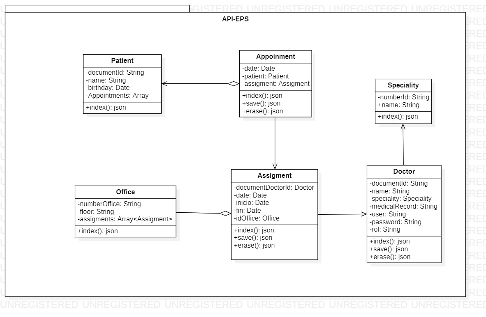
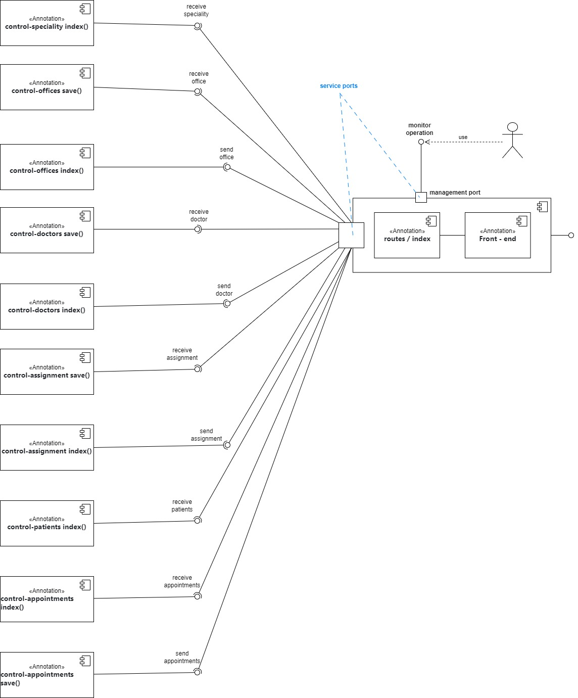
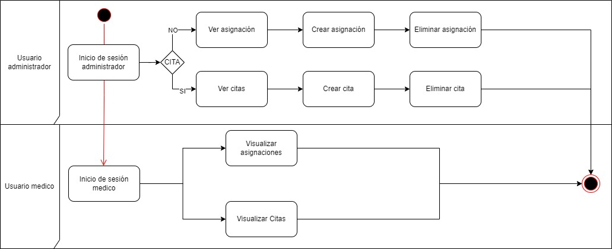
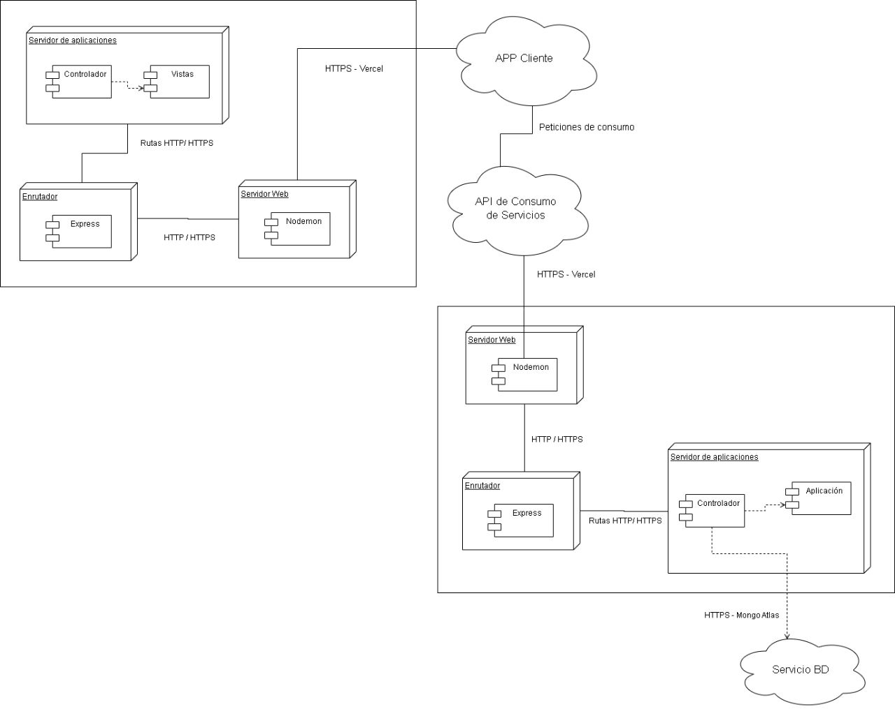
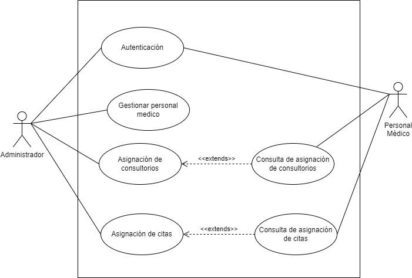

# Front - API RESTFULL 

Taller de front de apis. despliegue de front para aplicativo eps 
- Cristian Camilo Suancha Alvarez
- Laura Melissa Barrera Pinto

## Dependencias

- express
- nodemon
- cors

# Diseño modelo vistas 4+1 
## Vista lógica
El diagrama de clases representa la estructura de las clases principales en el sistema y sus relaciones. A continuación, se describen las clases identificadas:

* Doctor (Médico): Representa a los médicos registrados en el sistema. Cada médico tiene atributos como nombre, especialidad (Speciality of Doctor), y puede tener una o varias asignaciones de consultorios (Assignments of Offices) y citas (Appointment).

* Appointment (Cita): Representa una cita programada para un médico en una fecha y hora específicas. Cada cita está asociada a un paciente (Patient) y a una asignación (assigment). También tiene atributos para la fecha y hora de la cita.

* Speciality (Especialidad del Médico): Representa las diferentes especialidades médicas en las que un médico puede estar capacitado. Cada médico puede tener una especialidad.

* Assignment (Asignaciones de Consultorios): Representa las asignaciones de consultorios realizadas por el administrador para los médicos en fechas específicas. Cada asignación está asociada a un médico (Doctor) y a un consultorio (Office).

* Patient (Paciente): Representa a los pacientes registrados en el sistema. Cada paciente tiene atributos como nombre, dirección y contacto y un arreglo de citas.

* Office (Consultorio): Representa los consultorios disponibles en la EPS. Cada consultorio tiene atributos como número, ubicación y un arreglo de asignaciones.

  

## Vista de Desarrollo
El diagrama de componentes representa la estructura física del sistema y cómo sus componentes interactúan entre sí. En este caso, los componentes principales serían el Frontend (interfaz de usuario) y el Backend (lógica del sistema y base de datos).

  

## Vista de proceso
El diagrama de procesos muestra cómo interactúan los actores con el sistema y cómo se desarrollan las interacciones. En este caso, se representan los procesos de inicio de sesión y asignación de citas, tanto desde la perspectiva del Administrador como del Médico.

  

## Vista Física
El diagrama de despliegue muestra la distribución física de los componentes del sistema en el entorno de despliegue. A continuación, se describen los componentes identificados:

* Cliente Web: Representa el componente del sistema que se ejecuta en el navegador web del cliente. Es la interfaz de usuario a través de la cual los administradores y médicos interactúan con el sistema para gestionar consultorios y citas.

* Servidor de Aplicaciones: Es el componente del sistema que se encarga de manejar la lógica de negocio y las solicitudes del cliente web. Aquí se encuentra la lógica para administrar consultorios, citas, especialidades y asignaciones de consultorios.

* Base de Datos: Representa el sistema de gestión de base de datos donde se almacenan los datos del sistema, incluyendo información sobre médicos, pacientes, consultorios, citas y asignaciones. El servidor de aplicaciones se comunica con la base de datos para realizar operaciones de lectura y escritura.

  

## Escenarios 

El diagrama de casos de uso representa las funcionalidades principales del sistema desde el punto de vista de los actores externos. En este caso, los actores son el "Administrador" y los "Médicos". Los casos de uso identificados son:

* Iniciar Sesión: Tanto el Administrador como los Médicos pueden iniciar sesión en el sistema para acceder a sus respectivas funcionalidades.

* Gestionar personal médico: El Administrador tiene la capacidad de gestionar los médicos, .

* Administrar Consultorios: El Administrador tiene la capacidad de gestionar los consultorios, visualizando su disponibilidad en fechas y horas específicas, así como asignando consultorios a Médicos en días determinados.

* Ver Asignaciones de Consultorios: Tanto el Administrador como los Médicos pueden ver las asignaciones de consultorios realizadas. Los Médicos solo verán sus propias asignaciones.

* Asignar Citas: El Administrador puede asignar citas a los Médicos teniendo en cuenta las fechas y horarios disponibles de los consultorios y las citas ya asignadas.

* Ver citas: Tanto el Administrador como los Médicos pueden ver las asignaciones de citas realizadas. Los Médicos solo verán sus propias citas.

  

